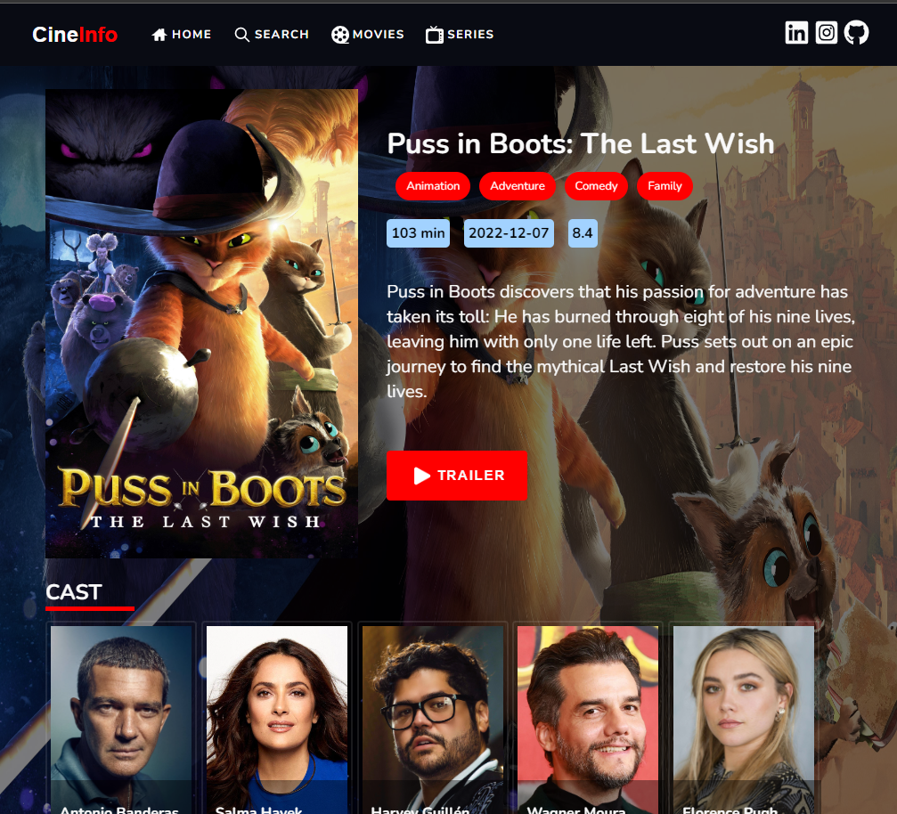
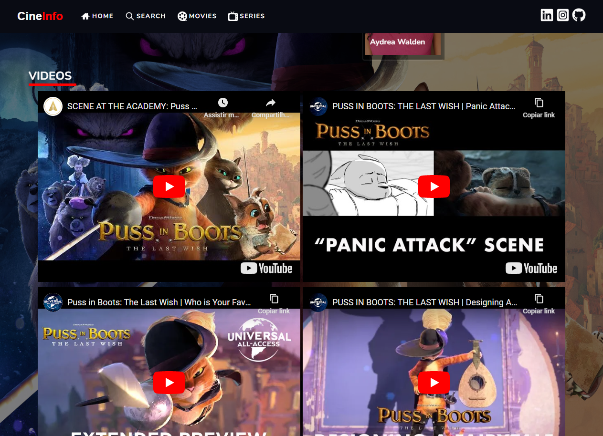
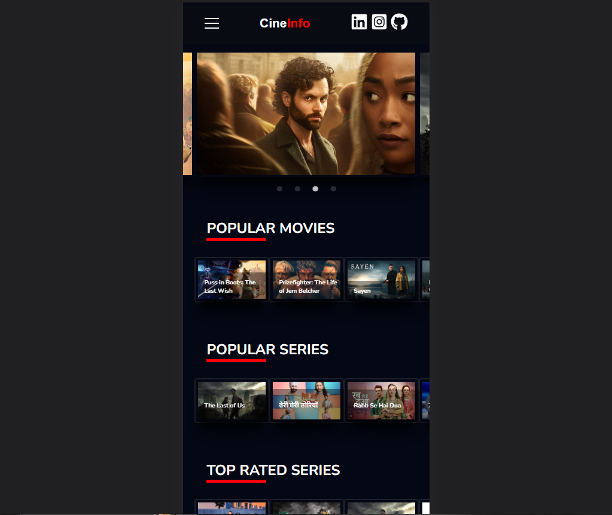
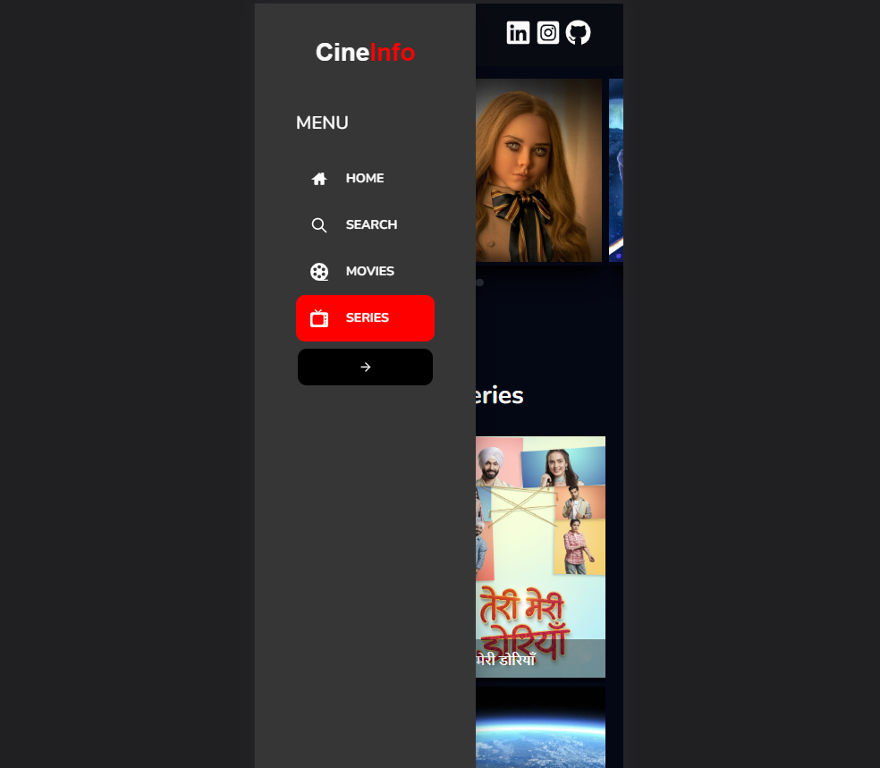
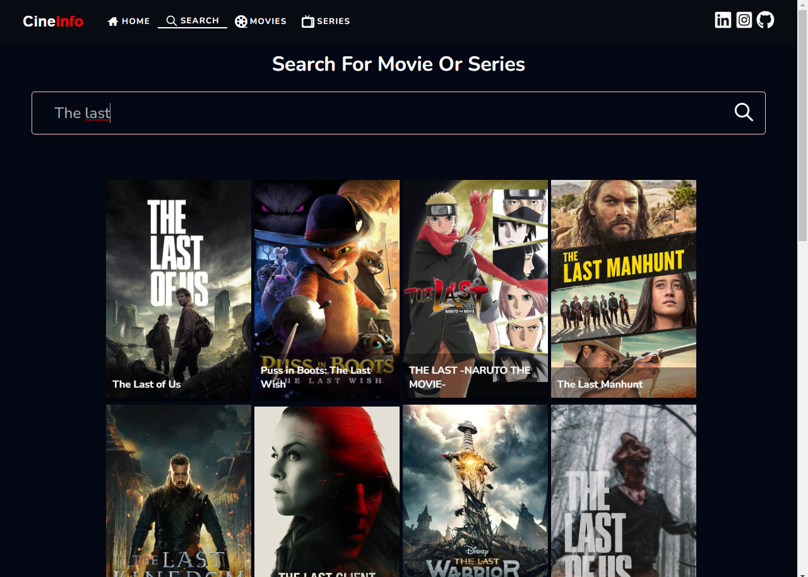

<h1 align="center">CineInfo</h1>

> Status do Projeto: concluido :heavy_check_mark:


### Tópicos

:small_blue_diamond: [Layout](#🎨-layout)

:small_blue_diamond: [Application Deploy](#🚀-application-deploy)

:small_blue_diamond: [Project Description](#💻-project-description)

:small_blue_diamond: [Functionalities](#🎓-functionalities)

:small_blue_diamond: [Technologies](#🧰-technologies)

:small_blue_diamond: [Prerequisites](#warning-prerequisites)

:small_blue_diamond: [Como rodar a aplicação](#como-rodar-a-aplicação-arrow_forward)

:small_blue_diamond: [Developers](#developers)

:small_blue_diamond: [License](#memo-license)


## 🎨 Layout

<p aling="center">
 
 
 
 
 
</p>


## 🚀 Application Deploy

> Live Preview: https://certificates-for-everyone-womakerscode.netlify.app/


## 💻 Project Description

<p align="justify">

**<h3>CineInfo:</h3>**

 - It is a Web Application to see details of movies and series, such as cast, trailers, duration, etc.

 - The application is completely responsive for all types of screens. 
 
 - It has 5 pages, Home, Details, Tv Series, Movies e Search.

 - It was developed using mainly the following technologies: JavaScrips, React, React Router Dom, API do TMDB, Styled-Components and Vercel.
   
</p>


## 🎓 Functionalities

*<h3>This application has:</h3>*

 - **Page Home:**

   - :heavy_check_mark: The user can see 4 sliders with posters of popular movies and series.
   - :heavy_check_mark: The user can have an overview of the application

 - **Page Details:**
   - *The user can see:*
     - :heavy_check_mark: Original Title
     - :heavy_check_mark: Gender
     - :heavy_check_mark: Release Year
     - :heavy_check_mark: Season Number
     - :heavy_check_mark: Description
     - :heavy_check_mark: Trailers
     - :heavy_check_mark: Poster
     - :heavy_check_mark: Cast
     - :heavy_check_mark: Duration

- **Page TV Series:**
  - :heavy_check_mark: The user can see the series that are trending.

- **Page Movie:**
  - :heavy_check_mark: The user can see the movies that are trending

- **Page Search:**
  - :heavy_check_mark: The user can search for the name of the movie or series and see the result on the screen.


## 🧰 Technologies

*This project was developed with the following technologies:*

- [React.JS](https://pt-br.reactjs.org/)
- [API TMDB](https://www.themoviedb.org/)
- [Styled Components](https://styled-components.com/)
- [JavaScript](https://www.javascript.com/)
- [React Router Dom](https://reactrouter.com/en/main)
- [Vercel/Netlify](https://vercel.com/)
- [Node.JS](https://nodejs.org/)
- [Git and Github](https://git-scm.com/)


## :warning: Prerequisites

- :warning: [Install Node](https://nodejs.org/en/download/)
- :warning: [TMDB free key](https://www.themoviedb.org/)


## Como rodar a aplicação :arrow_forward:

*In the terminal, clone the project:*

```
git clone https://github.com/BarbosaThaissa/cine-info
npm install
npm start
```


## Developers :octocat:

<br>

| [<br><sub>Thaíssa Barbosa</sub>](https://github.com/BarbosaThaissa) |


## :memo: License

*This project is under the MIT license*

<p aling="center">
 
</p>


**Copyright :copyright: 2023 - CineInfo**


Made with 💜 by myself : [My contact!] [contatothaissabarbosa@gmail.com]
